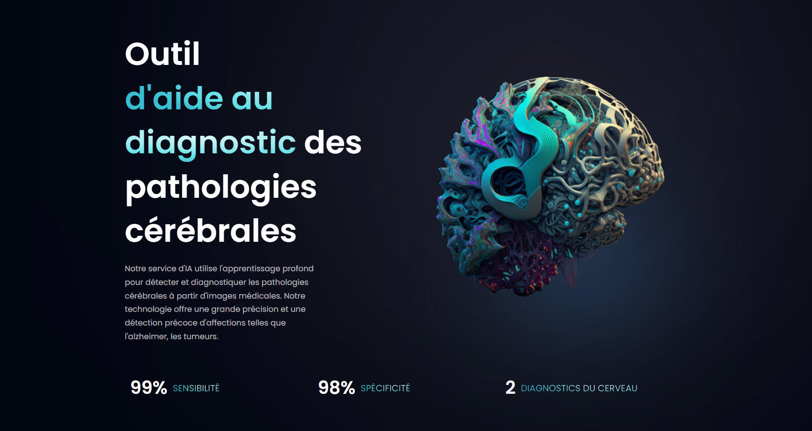

# 
Brainsight: Alzheimer prediction through CNN - Deep learning model

  
https://www.brainsight.tech

## Video presentation

[Bloc 6: BrainSight: Alzheimer prediction through CNN - Video presentation](xxxx)

## Additional information:

[Project presentation during Jedha Bootcamp DemoDay #38](https://youtu.be/cRNy1-rTXYg?t=2090)

[Video demonstration of the web app](https://www.youtube.com/watch?v=3anHg1pY6PQ)

Presentation slides are included in the project folder.

## Contact

You can write me at **sheichenkojuly@gmail.com**

## 🧐 Deployed apps
- FastAPI (RestAPI using Postgresdb): https://api.brainsight.tech/docsapi.brainsight.tech/docs
- Traefik (Reverse proxy)
- MinioS3
- MLFlow (using MySQLdb) : https://mlflow.brainsight.tech/
- Streamlit (used to upload MRI scan to be predicted): https://streamlit.brainsight.tech
- Nginx (website hosting)
        

## 🛠️ Tech Stack
- python
- pandas
- scikit-learn
- tensorflow (custom CNN model)
    
## 🙇 Authors
#### Laurent
- [github](https://github.com/lnilluv)
- [linkedin](https://www.linkedin.com/in/laurent-vullin/) 
#### Feriel
- [github](https://github.com/feeMdj)
- [linkedin](https://www.linkedin.com/in/ferielhamedi/) 
#### Alexon
- [github](https://github.com/Alexon1999)
- [linkedin](https://www.linkedin.com/in/alexon-uthayakumar-9361221a2/) 
#### Yuliya
- [github](https://github.com/YuliyaSheichenka)
- [linkedin](https://www.linkedin.com/in/yuliya-sheichenka-6568a653/) 
#### Haikel
- [github](https://github.com/haikel11)
- [linkedin](https://www.linkedin.com/in/ha%C3%AFkel-bouzazza-140647256/) 

## References

- Dataset on Kaggle: [Alzheimer's Dataset (4 class of Images)](https://www.kaggle.com/datasets/tourist55/alzheimers-dataset-4-class-of-images)
- [OASIS (Open Access Series of Imaging Studies) datasets](https://www.oasis-brains.org/)